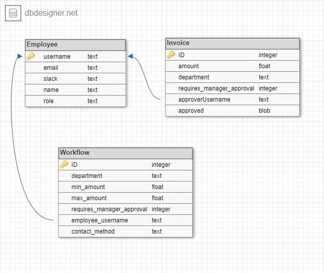

# Approval workflow challenge SOLUTION

This solution is an implementation of an invoice approval workflow application. 
The solution enables customers to configure each step of the approval process and define the workflow in terms of a set of rules. 
Each rule is responsible for sending an approval request via email or slack to the desired company employee based on one or more constraints.

## Features

- The whole application can be executed from the command line
- Submit an invoice via command line by passing invoice's amount, department, and whether a manager approval is required as arguments
- Delete the current Workflow
- Add rules to the current Workflow
- Print the current Workflow
- Support two ways to give approval: Slack and Email
- Five employees are included in the database

## Limitations

- User cannot modify previously entered rules, but needs to delete the workflow and create it again.
- Error messages are a bit general. Some errors might not be handled.
- Limited test coverage (only for showcasing)
- Employees cannot be added or removed

## Command Line Executables

The solution consists of four command line executables.
1. `--submit-invoice <amount[Double]> <department[FINANCE|MARKETING] <manager_approval[Boolean]`:
   * Submits an invoice for approval. The invoice gets automatically processed by checking
against each rule in the workflow. A message is sent to the corresponding employee
via the specified contact method.
   * Example: 
     ```sh
       ./gradlew run --args="--submit-invoice 10000 finance false"
     ```
2. `--delete-workflow`:
   * **Deletes the current Workflow**. Destroys all tables and deletes the memory file.
   * Example:
     ```sh 
     ./gradlew run --args="--delete-workflow"
     ```
3. `--add-rule-to-workflow`:
   * Allows the user to create a new rule and insert it into the workflow. 
   The rule will be appended at the end of the workflow and will be checked last.
   In order to create a new rule, the user will be prompted to enter rule constraints, one by one.
   Press [Enter] if you want to skip a constraint. These are presented in the following order:
     * **Minimum amount**: Enter the minimum invoice amount for the rule to pass
     * **Maximum amount**: Enter the maximum invoice amount
     * **Department**: Valid options are "Marketing" and "Finance"
     * **Requires Manager Approval**: Valid options are true and false
     * **Username of the employee to approve [required]**: Needs to be an existing employee username. Valid options are 
   "jsanders", "fkozjak", "jcop", "lsimon" and "meetsoon".
     * **Contact Method [required]**: Valid options are "email" and "slack".
     
     If the entered rule is valid, it gets appended to the Workflow. Otherwise, an error 
     is thrown. Finally, the user gets the option to add another rule or finish the program.

   * Example:
     ```sh
     ./gradlew run --args="--add-rule-to-workflow"
     ```

4. `--print-workflow`:
    * Prints the current workflow in a table format. Each row corresponds to a 
   rule. Rules are checked in ascending order.

    * Example:
      ```sh
      ./gradlew run --args="--print-workflow"
      ```
If none of these commands is entered, the executable returns an error message 
and lists the available options. If one of these commands fails to execute,
an error message is printed informing of the correct usage.

## Database model



Fig. 1: Database model of the solution.

The database model of the solution is shown in Fig. 1. It consists of three tables: 

* Employee
* Invoice
* Workflow

The Employee table is prefilled as follows: 

| username | name             | role            | email                       | slack             | 
|----------|------------------|-----------------|-----------------------------|-------------------|
| jsanders | Jonathan Sanders | CMO             | jonathan@light.inc          | jonathan          |
| fkozjak  | Filip Kozjak     | CFO             | filip@light.inc             | filip             |
| jcop     | Jelena Cop       | Finance Manager | jelena@light.inc            | jelena            |
| lsimon   | Lluis Simon      | Finance Member  | lluis.simon.92@gmail.com    | lluis.simon.92    |
| meetsoon | Meeting Soon     | Finance Member  | hope.to.meet.soon@light.inc | hope.to.meet.soon |

Once a new invoice is submitted, it gets processed by the Workflow, by comparing some columns
and returning the first occurrence. The username is used to join the workflow table
with the Employees table to retrieve the contact information of the employee that has to approve the expense.
Finally, the invoice information, the employee username and an approved status are stored in the Invoice Table.
The three tables are related by the username field which is unique.

## Initial Status

The workflow of Fig. 2 has been inserted into the database prior to handing off the solution
and should be available for testing. These are some suggested tests and the expected results:

```sh
./gradlew run --args="--submit-invoice 7000 marketing false"
> SLACK, Sending approval request for invoice #1 to Lluis Simon.
> Slack user: lluis.simon.92
> Role: Finance Member"
```
```sh
./gradlew run --args="--submit-invoice 400 finance true"
> SLACK, Sending approval request for invoice #2 to Meeting Soon.
> Slack user: hope.to.meet.soon
> Role: Finance Member"
```

```sh
./gradlew run --args="--submit-invoice 8000 marketing true"
> EMAIL, Sending approval request for invoice #3 to Jelena Cop.
> Email: jelena@light.inc
> Role: Finance Manager"
```


Fig. 2: Initial Workflow.

## Build and Run

### Run Tests

```sh
./gradlew test
```

### Run Clean Build
```sh
./gradlew clean build
```

### Run Executables
```sh
./gradlew run --args="--option arg1 arg2 ..."
```